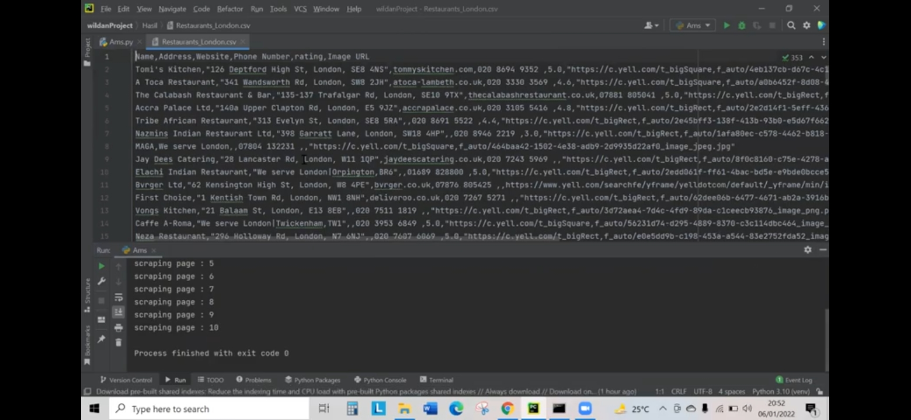

# webscraping
# Apa itu web scrapping?
- Dalam menjalankan bisnis online, pastinya Anda pernah mendata kompetitor-kompetitor Anda beserta informasi penting mengenai produk atau layanan mereka.
Kemudian, Anda menyimpan data tersebut di dalam sebuah spreadsheet — baik itu menggunakan Microsoft Excel, Google Sheet atau aplikasi sejenisnya. Proses inilah yang disebut sebagai web scraping.
Dengan kata lain, web scraping dapat didefinisikan sebagai proses pengambilan data dari sebuah website.Secara umum, ada dua cara yang bisa Anda gunakan untuk melakukannya:Manual — metode di mana Anda menyalin data dengan cara copy paste dari sebuah website
Otomatis — metode yang menggunakan koding, aplikasi, atau extension browser.

# Berikut langkah-langkah dalam membuat web scrapping:

- Membuka aplikasi phycharm atau sejenis nya yang dapat menjalankan perintah python.

- Buka situs web yang ingin anda scrapping,seperti contoh nya saya membuka web yell.com,seperti berikut:

- Setelah itu cari data untuk kita scrapping,seperti nama tempat dan lokasi nya
- berikut contoh nya:

- lalu masukkan coding ke dalam aplikasi phycharm seperti yang sudah saya upload pada repository ini

- langkah berikut nya,tekan tombol inspect pada web di bagian yang ingin kita ambil data nya.
- berikut gambaran nya:

- jika semua sudah selesai maka langkah selanjut nya adalah menjalankan hasil program.
- seperti ini gambaran program ketika sudah di jalankan:

# Demikian program ini saya buat.Mohon maaf bila ada kesalahan atau kekurangan dalam penjelasan.

# Terima kasih 